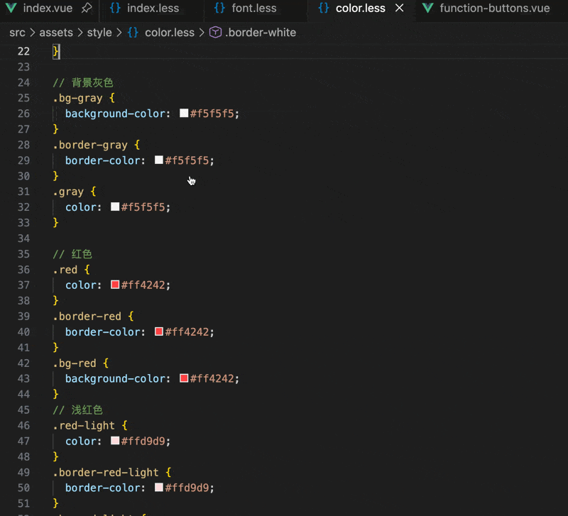
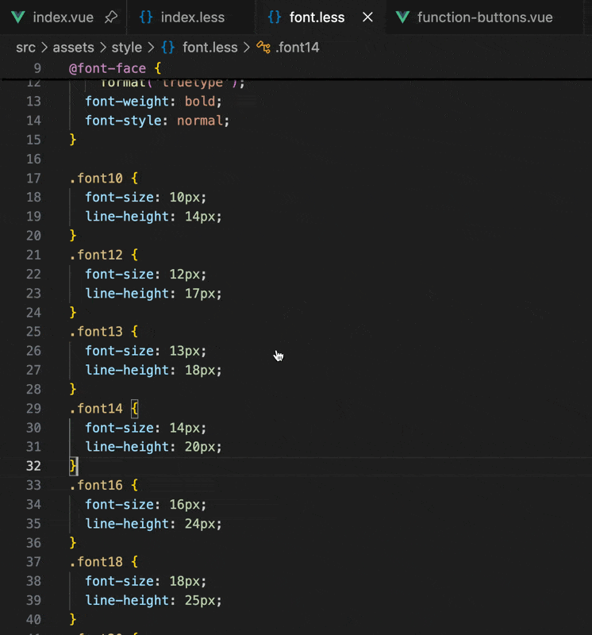
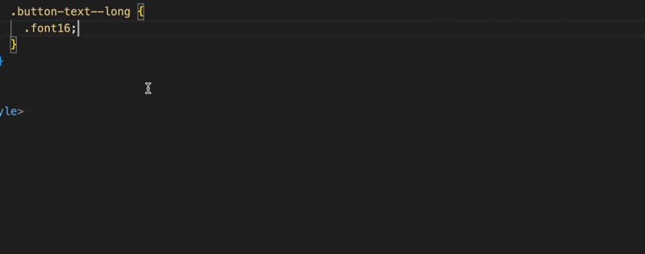
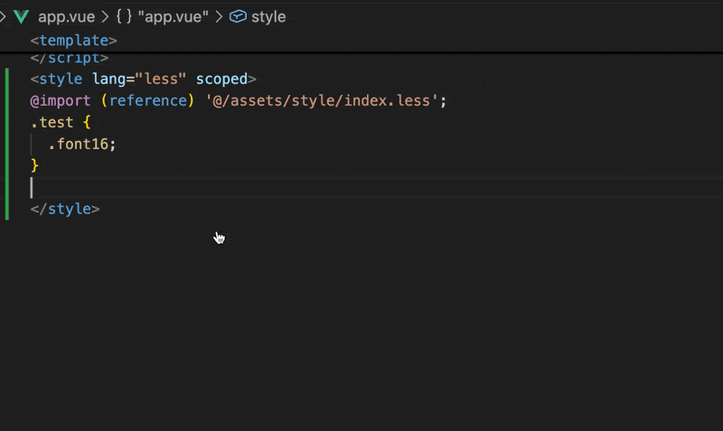

# easy-use-less-vue

🖖 一个方便使用 less 的 vscode 插件，专为 Vue 和 Less 开发优化

fork 自 https://github.com/ADKcodeXD/easier-less
在原插件基础上增强了 Vue SFC 支持和诸多实用功能

## ✨ 核心功能

### 1. 🚀 智能自动导入（新功能）
- 🎯 **自动添加 import**：使用变量或类名时，自动检测并添加 `@import (reference)` 语句
- 🔧 **动态别名解析**：读取项目的 `jsconfig.json`/`tsconfig.json`，支持所有配置的路径别名
- 🛡️ **防重复导入**：智能识别已导入的文件，避免重复（支持别名和相对路径）
- 📂 **优先使用别名**：自动使用项目配置的别名（如 `@/`），使代码更简洁
- 🧹 **注释安全检测**：导入检测会忽略注释中的 `@import`，避免误判为已导入
- ⚠️ **Vue 场景保护**：在无 `<style>` 标签时不会错误插入导入语句，并给出提示

### 2. 智能自动补全
- 📝 **变量补全**：输入 `@` 自动提示所有 Less 变量，色值变量会显示颜色
- 🎯 **类名/Mixin 补全**：输入 `.` 自动提示所有类名和 Mixin 方法
- 🎨 **Vue SFC 支持**：在 `.vue` 文件的 `<style lang="less">` 标签内智能触发
- 🚫 **智能过滤**：自动排除括号内的补全（避免在函数参数中误触发）
- ⚡ **增强过滤**：支持输入部分变量名继续补全（如 `color: @p` 可提示 `@primary-color`）
- ✍️ **上下文感知插入**：会根据右侧是否已有 `()`、参数、`;`、注释决定插入内容，避免重复拼接
- 🎯 **中间光标替换**：在标识符中间触发补全时，会连同右侧后缀一起替换（如 `@primary-co|lor`）

### 3. 增强悬浮提示
- 🔍 **变量悬停**：鼠标悬停在 Less 变量（如 `@primary-color`）的任意位置，即时显示其定义值
- 🎨 **类名悬停**：鼠标悬停在类名（如 `.bg-black`）的任意位置，显示完整的类定义
- 💡 **智能识别**：自动识别光标所在的完整变量名或类名，无需精确点击 `@` 或 `.` 符号
- 📄 **多文件支持**：同时支持 `.less` 和 `.vue` 文件
- 🎯 **格式优化**：类定义自动格式化为多行显示，提升可读性

### 4. 跳转定义
- ⚡ 按住 `Cmd/Ctrl` 点击变量或类名，直接跳转到定义位置
- 📍 支持 Less 文件和 Vue SFC 中的跳转
- 🎯 支持普通 CSS 类名和 Mixin 方法的跳转

### 5. 🔥 路径别名支持
- 📂 支持 `@/` 路径别名（指向项目根目录）
- 🔗 自动解析相对路径和绝对路径
- 🎯 配置文件时自动转换为 `@/` 格式，便于项目迁移

### 6. 🔄 递归导入加载
- 📦 自动递归加载 `@import` 导入的所有文件
- 🛡️ 智能循环引用保护
- 🌳 支持多层嵌套导入

### 7. ⚡ 实时文件监听
- 👀 监听所有 Less 文件（包括递归导入的文件）
- 🔄 文件修改后自动重新加载，无需重启 VS Code
- 📢 状态栏实时显示加载状态
- ⚠️ 文件删除时显示警告提示

### 8. 🎨 增强的 CSS 类支持
- ✅ 支持普通 CSS 类（如 `.button`）
- ✅ 支持 Mixin 方法（如 `.button(@color)`）
- ✅ 自动去重，避免补全时出现双点号

### 9. 🧪 稳定性与测试保障
- 🧱 **核心逻辑解耦**：将别名解析、编辑器判断、自动导入与 watcher 判断下沉到 core 模块，降低耦合
- ♻️ **生命周期加固**：重载前清理注册项与 watcher，避免重复注册和资源残留
- 📈 **运行时诊断**：记录重载耗时、watcher 数量和注册项数量，支持阈值校验
- ✅ **单元测试覆盖**：新增并持续扩展 `alias/autoImport/editor/diagnostics/getStore/watcher/welcome` 核心测试


## 🎬 功能演示

### 自动导入 Less 文件（新功能）
当你使用变量或类名时，如果当前文件还未导入对应的 Less 文件，插件会自动添加 `@import (reference)` 语句：

```vue
<style lang="less" scoped>
.my-component {
  color: @primary-color; /* 👈 输入并选择补全后，自动添加 import */
  .font10; /* 👈 选择类名后，自动添加 import */
}
</style>
```

**自动添加的 import：**
```less
@import (reference) '@/assets/style/index.less'; /* ✅ 自动添加，使用别名 */

.my-component {
  color: @primary-color;
  .font10;
}
```

**特性：**
- ✅ 自动使用项目配置的别名（如 `@/`）
- ✅ 避免重复导入
- ✅ 使用 `(reference)` 避免重复输出 CSS

### 变量自动补全

### 方法自动补全

### 悬浮提示

### 跳转定义


## ⚠️ 重要提示

### 从旧版本升级到 v0.0.3+

如果你从旧版本（v0.0.2 或更早）更新到 v0.0.3 或更高版本，**必须**执行以下步骤才能使用新的别名解析功能：

1. 删除 `.vscode/settings.json` 中的 `less.files` 配置
2. 重新打开项目，按提示重新选择 mixin 文件

这样可以确保插件使用项目配置的路径别名（如 `@/`）而不是硬编码的路径。

## 🚀 使用

### 初次使用
1. 打开项目，打开任意 Less 或 Vue 文件
2. 插件会提示选择 Mixin 文件（存放变量、方法的文件）
3. 支持多选文件，选择后自动保存到项目配置

### 手动配置

在项目根目录创建或编辑 `.vscode/settings.json`：

```json
{
  "less.files": [
    "@/src/styles/variables.less",
    "@/src/styles/mixins.less",
    "src/styles/theme.less"
  ],
  "less.notice": true,
  "less.suppressNotice": false
}
```

#### 配置说明

- **`less.files`**: Less 文件路径数组
  - 支持 `@/` 别名（指向项目根目录）
  - 支持相对路径（相对于项目根目录）
  - 支持绝对路径

- **`less.notice`**: 是否显示初次使用提示（默认 `true`）
  - 全局配置，影响所有项目

- **`less.suppressNotice`**: 不再提示选择 Mixin 文件（默认 `false`）
  - 项目级别配置，仅对当前项目生效
  - 点击弹窗中的"不再提示"按钮后自动设置为 `true`
  - 删除或改为 `false` 可重新启用提示

### 路径格式示例

```json
{
  "less.files": [
    // ✅ 推荐：使用 @ 别名
    "@/src/styles/variables.less",

    // ✅ 支持：相对路径
    "src/styles/mixins.less",

    // ✅ 支持：绝对路径
    "/Users/username/project/src/styles/theme.less"
  ]
}
```

## 🎯 使用场景

### 场景 1：Less 文件中使用
```less
// 输入 @ 自动补全变量
.container {
  color: @primary-color; // 自动补全并显示色值
}

// 输入 . 自动补全 Mixin
.box {
  .border-radius(4px); // 自动补全方法名
}
```

### 场景 2：Vue SFC 中使用
```vue
<template>
  <div class="my-component"></div>
</template>

<style lang="less" scoped>
.my-component {
  // 在 style 标签内，输入 @ 或 . 触发补全
  background: @bg-color;
  .flex-center(); // Mixin 补全
}
</style>
```

### 场景 3：递归导入
```less
// variables.less
@primary-color: #1890ff;
@import './theme.less';

// theme.less
@import './colors.less';
@theme-bg: @base-color; // 来自 colors.less

// colors.less
@base-color: #fff;
```
**✨ 插件会自动加载所有三个文件，支持跨文件的变量补全和跳转**

## 🔧 高级功能

### 自动重新加载
修改任何 Less 文件后：
1. 📊 状态栏显示：`$(sync~spin) 重新加载 Less 文件...`
2. 🔄 自动重新解析所有文件
3. ✅ 完成后提示：`$(check) Less 文件已加载 (N 个文件)`

### 智能括号检测
插件会智能判断光标位置，避免在不合适的地方触发补全：
```less
// ✅ 会触发补全
.box {
  color: @|  // 光标位置
}

// ❌ 不会触发补全（在括号内）
.mixin(@color: @|) {  // 避免在参数中误触发
}
```

### Vue 文件智能识别
只在 `<style>` 标签内触发补全：
```vue
<template>
  <div>@|</div>  <!-- ❌ 不触发 -->
</template>

<style lang="less">
.box {
  color: @|  <!-- ✅ 触发补全 -->
}
</style>
```

## 🆚 与原版对比

| 功能 | 原版 | 增强版 |
|------|------|--------|
| Vue SFC 支持 | ❌ | ✅ |
| 递归 @import 加载 | ❌ | ✅ |
| 路径别名 (@/) | ❌ | ✅ |
| **自动导入 Less 文件** | ❌ | ✅ **新增** |
| **动态别名解析** | ❌ | ✅ **新增** |
| **增强悬停提示（变量+类名）** | 部分 | ✅ **增强** |
| 实时文件监听 | 部分 | ✅ 全量 |
| 普通 CSS 类支持 | ❌ | ✅ |
| 智能括号检测 | ❌ | ✅ |
| 工作区配置 | ❌ | ✅ |
| 状态栏提示 | ❌ | ✅ |

## 📝 更新日志

### v0.1.0 (最新)
- ✨ 核心模块重构：新增 `aliasCore`、`autoImportCore`、`editorCore`、`watcherCore`、`welcomeCore`、`diagnostics`，提升可维护性
- 🔄 生命周期改进：初始化/重载链路加入资源清理与重建，降低重复注册与 watcher 残留风险
- 🧪 单测体系升级：新增并完善多个核心模块单元测试，形成稳定回归门禁
- 🐛 自动导入修复：忽略注释中的 `@import`，并完善 Vue 无 `<style>`、CRLF 等边界场景
- 🐛 补全行为修复：解决中间光标补全重复拼接问题，补全插入支持右侧上下文感知（含参数调用、分号与注释）
- 🐛 定义识别修复：支持 `@primary-color` 这类连字符变量符号识别

### v0.0.4
- 🐛 修复注释中的 @import 语句也会被加载的问题

### v0.0.3
- ✨ **自动导入 Less 文件**：使用变量或类名时自动添加 `@import (reference)` 语句
- ✨ **动态别名解析**：读取项目配置文件，支持所有配置的路径别名
- ✨ **防重复导入机制**：智能检测已导入文件，避免重复
- ✨ **增强悬停提示功能**：支持 Less 变量和类名的智能悬停提示
- ✨ 支持在变量名和类名的任意位置悬停显示定义
- ✨ 同时支持 `.less` 和 `.vue` 文件中的悬停功能
- 🔄 改进自动补全：支持输入部分变量名继续补全
- 🔄 优化显示格式：类定义自动格式化为多行显示
- 🔄 改进识别逻辑：智能识别光标所在位置的完整变量名或类名
- 🐛 修复别名路径解析和重复导入问题
- 🐛 修复初始化配置时硬编码 `@/` 别名的问题，现在会根据实际配置的别名生成路径
- 🐛 修复更改别名配置后路径不会更新的问题

> ⚠️ **从旧版本升级请注意**：请查看上方"重要提示"部分

### v0.0.2
- ✨ 新增实时文件监听，修改后自动重新加载
- ✨ 监听所有递归导入的 Less 文件
- ✨ 添加状态栏加载提示
- ✨ 初次使用提示增加"不再提示"选项
- ✨ 支持项目级别的提示控制，不影响其他项目

### v0.0.1
- ✨ 添加路径别名 `@/` 支持
- ✨ 实现递归 @import 加载功能
- ✨ 添加循环引用保护
- ✨ 支持普通 CSS 类的自动补全和跳转
- ✨ Vue SFC 中的智能补全（仅在 style 标签内）
- ✨ 智能括号检测，避免误触发
- ✨ 修复重复点号问题
- ✨ 配置保存到工作区而非用户设置
- ✨ 移除重复的更新提示
- ✨ Vue 文件中支持跳转定义

## 🤝 贡献

欢迎提交 Issue 和 Pull Request！

## 📄 License

MIT

## 🙏 致谢

- 原项目：[easier-less-vue](https://github.com/ADKcodeXD/easier-less)
- Fork 并增强：[easier-less-vue](https://github.com/dmxiaoshubao/easier-less)
